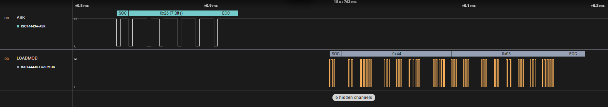

# ISO14443A-ASK / -LOADMOD Analyzer

This is a low level analyzer for the ISO14443A protocol.

There are two different protocols implemented in ISO14443-2. For each of it there is a separate low level analyzer:

- `ISO14443A-ASK`: 100% ASK (PCD to PICC)
- `ISO14443A-LOADMOD`: Loadmodulation (PICC to PCD)



The ISO14443-2 protocol defines multiple datarates, but this analyzer supports onyl 106 kBit/s (fc/128).


The following settings are available for `ISO14443A-ASK` analyzer:


The following settings are available for `ISO14443A-LOADMOD` analyzer:


# Installation Instructions

To use this analyzer, simply download the latest release zip file from this github repository, unzip it, then install using the instructions found here:

https://support.saleae.com/faq/technical-faq/setting-up-developer-directory

# Publishing Releases
This repository is setup with Github Actions to automatically build PRs and commits to the master branch.

However, these artifacts automatically expire after a time limit.

To create and publish cross-platform releases, simply push a commit tag. This will automatically trigger the creation of a release, which will include the Windows, Linux, and MacOS builds of the analyzer.

## Building your Analyzer
CMake and a C++ compiler are required. Instructions for installing dependencies can be found here:
https://github.com/saleae/SampleAnalyzer

The fastest way to use this analyzer is to download a release from github. Local building should only be needed for making your own changes to the analyzer source.

### Windows

```bat
mkdir build
cd build
cmake .. -A x64
cmake --build .
:: built analyzer will be located at SampleAnalyzer\build\Analyzers\Debug\SimpleSerialAnalyzer.dll
```

### MacOS

```bash
mkdir build
cd build
cmake ..
cmake --build .
# built analyzer will be located at SampleAnalyzer/build/Analyzers/libSimpleSerialAnalyzer.so
```

### Linux

```bash
mkdir build
cd build
cmake ..
cmake --build .
# built analyzer will be located at SampleAnalyzer/build/Analyzers/libSimpleSerialAnalyzer.so
```
